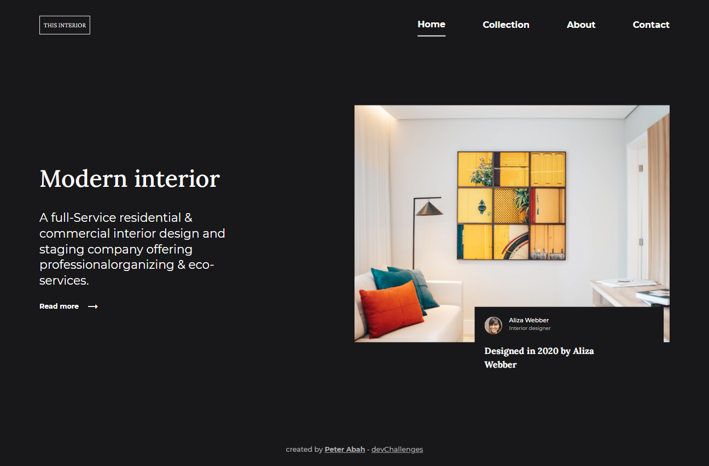
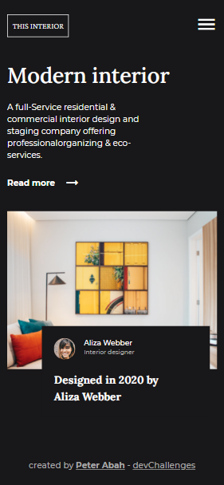
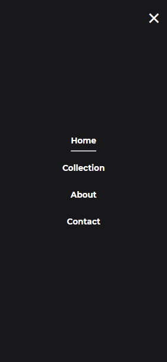

<!-- Please update value in the {}  -->

<h1 align="center">Interior Consultant Page</h1>

   Solution for a challenge from  <a href="http://devchallenges.io" target="_blank">Devchallenges.io</a>.

  <h3>
    <a href="https://peter-abah.github.io/interior-consultant-page">
      Demo
    </a>
     | 
    <a href="https://devchallenges.io/solutions/JL5GVjQx5618SW8rzk6H">
      Solution
    </a>
     | 
    <a href="https://devchallenges.io/challenges/Jymh2b2FyebRTUljkNcb">
      Challenge
    </a>
  </h3>

<!-- TABLE OF CONTENTS -->

## Table of Contents

- [Overview](#overview)
  - [Built With](#built-with)
- [Contact](#contact)
- [Acknowledgements](#acknowledgements)

<!-- OVERVIEW -->

## Overview

### Desktop Screenshot

### Mobile Screenshot

This is a simple interior consultant page from [DevChallenges](https://devchallenges.io) built with [Tailwind Css Framework](https://tailwindcss.com).
I used this project to practice TailwindCss.

### Built With
- HTML
- [Tailwind](https://tailwindcss.com/)

## Acknowledgements
- [Tailwind Docs](https://tailwindcss.com/docs)

## Contact

- GitHub [@peter-abah](https://github.com/peter-abah)
- Twitter [@iamabah1](https://twitter.com/iamabah1)
